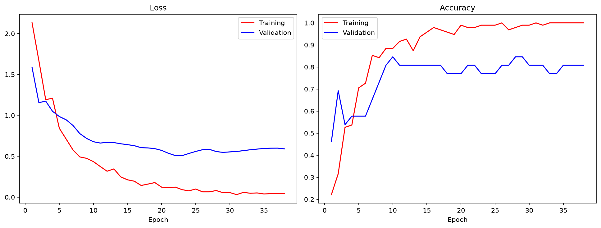
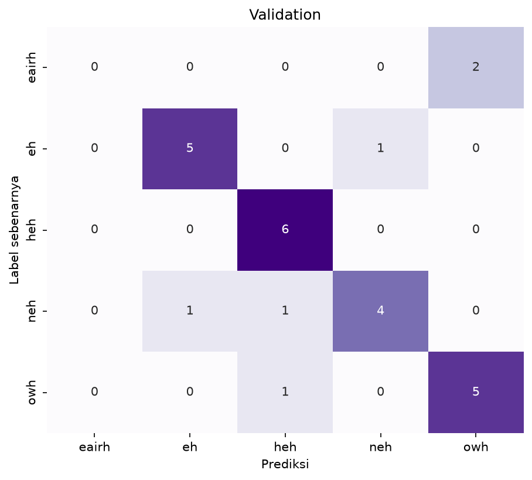
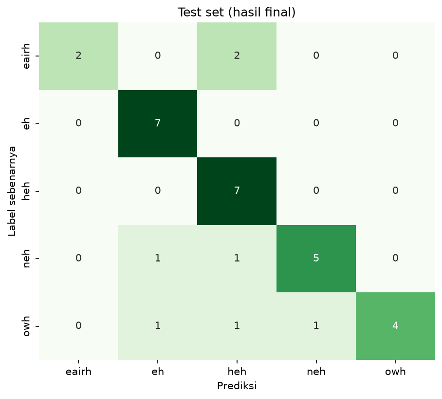

# Klasifikasi Tangisan Bayi — Intermediate Fusion (Citra + Audio, backbone ResNet50)

Model klasifikasi jenis tangisan bayi dari video, memakai pendekatan **intermediate / feature-level fusion**: cabang citra dan cabang audio masing-masing mengekstrak fitur, baru digabung sebelum classifier akhir.

## Ringkasan pendekatan

| Aspek | Keputusan |
|---|---|
| **Unit data** | 1 video = 1 sample (5 frame diringkas jadi 1 vektor lewat rata-rata, bukan baris data terpisah) |
| **Cabang citra** | Transfer learning — **ResNet50** (ImageNet, dibekukan), hanya layer proyeksi kecil di atasnya yang dilatih |
| **Cabang audio** | CNN kecil dilatih dari nol dari mel-spectrogram (grayscale, nilai mentah) |
| **Titik fusi** | `Concatenate` fitur citra (128-d) + fitur audio (128-d) → 256-d → classifier |
| **Split** | 3 arah — **test diambil langsung dari folder `data_test_video`** (bukan hasil pecahan acak), sisanya dipecah stratified-group jadi train/val |
| **Kelas** | `eairh` (masuk angin), `eh` (perlu bersendawa), `heh` (tidak nyaman), `neh` (lapar), `owh` (mengantuk) |
| **Metrik** | Accuracy + macro F1 |

## Dataset & split

Video dibaca dari `Data_Video_Bayi/<kelas>/{data_train_video, data_test_video}`. Split video (bukan frame) memakai `GroupShuffleSplit` per kelas agar tidak ada satu video pun bocor ke lebih dari satu sisi.

| Split | Jumlah video | Distribusi per kelas |
|---|---|---|
| Train | 95 | eairh 7 · eh 22 · heh 22 · neh 22 · owh 22 |
| Valid | 26 | eairh 2 · eh 6 · heh 6 · neh 6 · owh 6 |
| Test  | 32 | eairh 4 · eh 7 · heh 7 · neh 7 · owh 7 |

## Arsitektur model

- **Cabang citra**: `ResNet50` (`include_top=False`, `pooling='avg'`, weights ImageNet, **dibekukan**) diterapkan ke 5 frame per video lewat `TimeDistributed`, fitur antar-frame dirata-ratakan (`GlobalAveragePooling1D`) → `LayerNormalization` → `Dense(128, relu)`.
- **Cabang audio**: 3 blok `Conv2D` (16→32→64 filter) + `MaxPooling2D`, `GlobalAveragePooling2D` → `Dense(128, relu)`.
- **Fusi**: `Concatenate` kedua fitur (256-d) → `Dropout(0.4)` → `Dense(5, softmax)`.
- **Parameter**: 299.269 dilatih, 23.587.712 dibekukan (backbone ResNet50, dim fitur 2048).

## Training

- Optimizer `AdamW` (lr 1e-3, weight decay 0.01), loss `SparseCategoricalCrossentropy`.
- Callback: `EarlyStopping` (monitor `val_loss`, patience 15, restore best weights), `ModelCheckpoint` (`val_accuracy` terbaik), `ReduceLROnPlateau` (factor 0.5, patience 6).
- Run terbaru memuat **38 epoch**. Akurasi training mencapai 1.000, sedangkan akurasi validation berfluktuasi di kisaran 0.769–0.846; jarak ini menunjukkan model mulai menghafal data training dan performa generalisasinya masih terbatas.



Loss training terus turun hingga mendekati 0, tetapi loss validation berhenti membaik di sekitar 0.5–0.6. Pola ini konsisten dengan overfitting: model sangat baik pada data training, namun belum memperoleh performa setara pada data yang tidak dilihat saat training.

## Hasil evaluasi

### Validation set



| Kelas | Precision | Recall | F1 | Support |
|---|---|---|---|---|
| eairh | 0.0000 | 0.0000 | 0.0000 | 2 |
| eh | 0.8333 | 0.8333 | 0.8333 | 6 |
| heh | 0.7500 | 1.0000 | 0.8571 | 6 |
| neh | 0.8000 | 0.6667 | 0.7273 | 6 |
| owh | 0.7143 | 0.8333 | 0.7692 | 6 |

**Accuracy: 0.7692 · Macro F1: 0.6374**

### Test set (hasil final)



| Kelas | Precision | Recall | F1 | Support |
|---|---|---|---|---|
| eairh | 1.0000 | 0.5000 | 0.6667 | 4 |
| eh | 0.7778 | 1.0000 | 0.8750 | 7 |
| heh | 0.6364 | 1.0000 | 0.7778 | 7 |
| neh | 0.8333 | 0.7143 | 0.7692 | 7 |
| owh | 1.0000 | 0.5714 | 0.7273 | 7 |

**Accuracy: 0.7812 · Macro F1: 0.7632**

Pada test set, kelas **eairh** salah diprediksi sebagai **heh** pada 2 dari 4 video. Kelas **neh** juga tertukar dengan `eh` dan `heh`, sedangkan kelas **owh** tertukar masing-masing satu kali dengan `eh`, `heh`, dan `neh`. Kelas `eh` dan `heh` memiliki recall sempurna, tetapi precision `heh` masih rendah karena menerima prediksi dari kelas lain. Pola ini menunjukkan bahwa eairh, neh, dan owh masih membutuhkan lebih banyak variasi data atau pemisahan fitur audio-visual yang lebih baik.

## Struktur folder

```
.
├── Data_Video_Bayi
|   ├── eairh
|   ├── eh
|   ├── heh
|   ├── neh    
|   └── owh
├── model_resnet.ipynb              # notebook lengkap (ekstraksi data, model, training, evaluasi)
├── README.md                       # file ini
└── results/
    ├── training_curves.png         # loss & accuracy per epoch (train vs val)
    ├── confusion_matrix_validation.png
    └── confusion_matrix_test.png
```

## Cara pakai ulang

1. Siapkan folder `Data_Video_Bayi/<kelas>/data_train_video/` dan `Data_Video_Bayi/<kelas>/data_test_video/` berisi video mentah.
2. Jalankan `model_resnet.ipynb` dari atas ke bawah.
3. Model tersimpan sebagai `tangis_bayi_fusion.keras`; gunakan fungsi `predict_video(path)` di notebook untuk inferensi video baru.

## Catatan

Tabel ringkasan pendekatan menyebut backbone bersifat pluggable (`BACKBONE = 'mobilenet'` atau `'resnet'`) — run ini memakai **ResNet50**. Kalau nanti dibandingkan dengan run MobileNetV2, disarankan simpan hasil run itu di sub-folder terpisah (misal `results/resnet/` vs `results/mobilenet/`) agar tidak saling menimpa.
